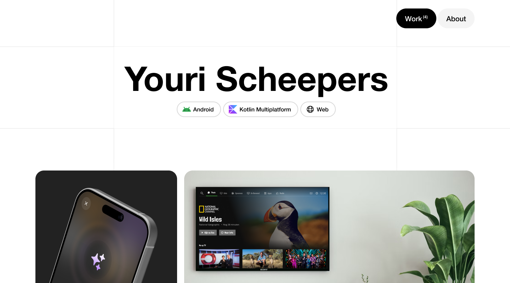
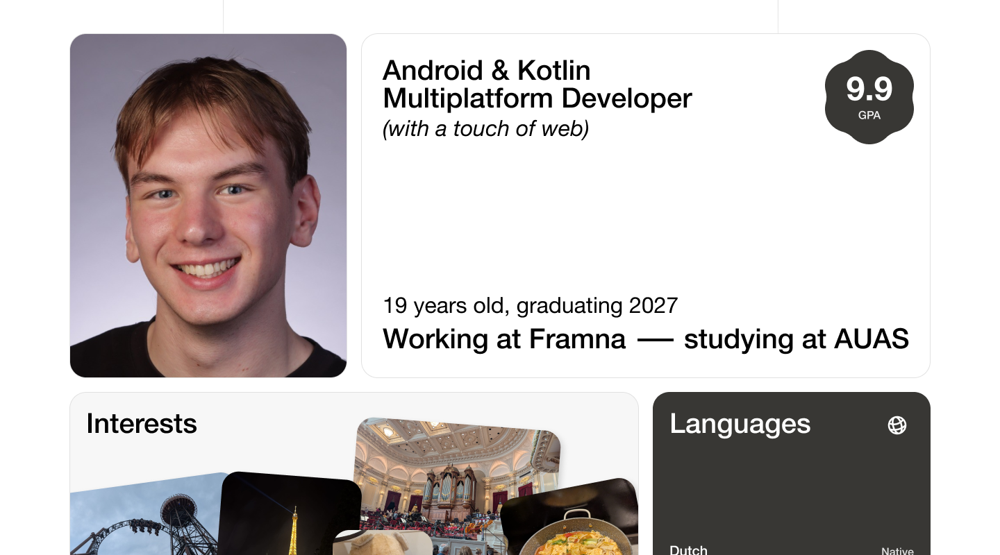
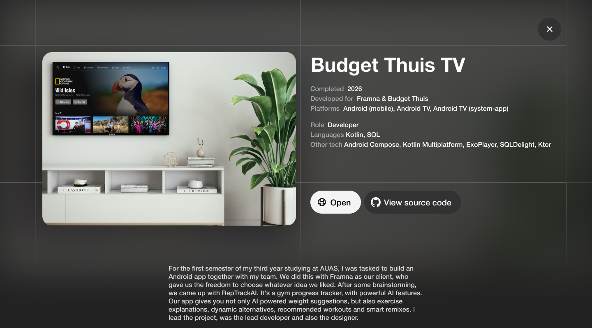

# Developer Portfolio

This is my portfolio website. It's contains information about me, the work I've done and links to my other channels. It's meant as a showcase of my skills and experience. The website was designed by me, following a simple and flat design language. Make sure to take a look [here](https://www.yourischeepers.com/)!

*Home of the portfolio*

## 🚀 Built with

- ⚡ **Vite** as the build tool
- 🖼️ **Vue.js** as the main framework
- 🧠 **TypeScript** as the programming language
- 🎨 **TailwindCSS** for styling
- 🎬 **Lottie** for animated icons

## ✨ Features

- 📝 **Contentful integration** for dynamic content that can be edited at any time
- 🔄 **Automatic deployment** using GitHub Actions and GitHub Pages
- 🔍 **SEO optimized** so that everyone can find the website on search engines

## 📸 Screenshots

